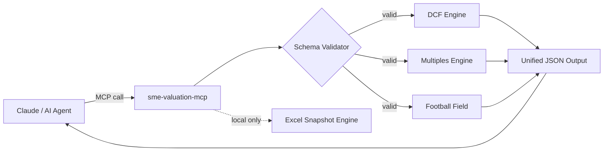

<div align="center">

# 🏦 SME Valuation MCP

### The valuation engine that runs inside your AI agent.

**DCF · Multiples · Football Field — exposed as MCP tools for Claude and any LLM agent.**


[**Quick Start**](#quick-start) · [**MCP Tools**](#available-mcp-tools) · [**Deploy**](#deploy-on-render) · [**Examples**](#examples)

</div>

---

## The Problem

Valuing an SME requires DCF models, comparable multiples, and Football Field synthesis —
work that takes a financial analyst hours in Excel.

**SME Valuation MCP wraps that entire engine as callable MCP tools**, so Claude (or any
MCP-compatible agent) can run a full professional valuation in seconds, on any payload you feed it.

No consultants. No spreadsheets. Just structured JSON in, structured valuation out.

---

## How It Works



---

## Quick Start

```bash
# 1. Clone & install
git clone https://github.com/PMIScoutAI/sme-valuation-mcp.git
cd sme-valuation-mcp
python -m venv .venv && .venv\Scripts\activate
pip install -r requirements.txt

# 2. Start MCP server
python -m src.mcp_server

# 3. Or use the helper script
powershell -ExecutionPolicy Bypass -File .\scripts\start_mcp.ps1
```

---

## Available MCP Tools

| Tool | Description | Returns |
|------|-------------|---------|
| `validate_input(payload_json)` | Validates payload against JSON schema | `ok`, `errors` |
| `run_valuation(payload_json)` | Runs full valuation (DCF + Multiples + FF) | Full valuation JSON |
| `get_model_spec()` | Returns the model specification | YAML content |
| `list_scenarios()` | Lists available sample scenarios | File list |

---

## Use Cases

**For AI Developers**
Integrate professional-grade valuation into your agent workflows. Use `run_valuation()` as a tool call within any Claude or LangChain pipeline.

**For SaaS Founders**
Embed a due-diligence valuation layer in your product without building the financial model from scratch. Fork, adapt, deploy.

**For Financial Consultants**
Run repeatable, auditable valuation workflows via Claude — and export results to Excel for client-ready presentations.

---

## Examples

### Example 1 — Ready-to-paste Claude prompt

```
Use the MCP server "sme-valuation-engine".
1. Call list_scenarios() and pick sample_inputs_1.json
2. Load that JSON and call validate_input(payload_json)
3. If valid, call run_valuation(payload_json)
4. Return: DCF enterprise value, Multiples EV, Football Field low/mid/high,
   and 3 projected revenue values
```

### Example 2 — Minimal JSON payload

```json
{
  "meta": { "company_name": "Acme SME", "currency": "EUR", "years": 5 },
  "actuals": {
    "revenue": [12.5, 13.1, 14.0],
    "ebitda": [2.1, 2.3, 2.6],
    "nfp": 4.5
  },
  "assumptions": {
    "tax_rate": 0.27, "wacc": 0.11, "terminal_growth": 0.02,
    "revenue_cagr": 0.06, "ebitda_margin": 0.19,
    "capex_pct_revenue": 0.04, "nwc_pct_revenue": 0.03
  },
  "multiples": { "ev_ebitda_multiple": 7.5, "ev_ebit_multiple": 10.0 }
}
```

**Expected output sections:**
- `projections.revenue` · `projections.ebitda` · `projections.fcf`
- - `valuation.dcf.enterprise_value` · `valuation.dcf.equity_value`
  - - `valuation.multiples.enterprise_value` · `valuation.multiples.equity_value`
    - - `valuation.football_field.low` · `valuation.football_field.mid` · `valuation.football_field.high`
     
      - ### Example 3 — Run engine without MCP
     
      - ```bash
        python -m src.engine.run \
          --input data/samples/sample_inputs_1.json \
          --schema spec/schema.json \
          --output data/samples/sample_output_1.json
        ```

        ### Example 4 — Validate input shape

        ```bash
        python -m unittest tests/test_schema_validation.py -v
        ```

        ---

        ## Requirements

        | Requirement | Notes |
        |-------------|-------|
        | Python 3.11+ | Core runtime |
        | Windows (local) | Required only for Excel snapshot generation |
        | Microsoft Excel (local) | Required only for Excel snapshot generation |
        | Render / Linux | Full remote MCP runtime (no Excel dependency) |

        ---

        ## Deploy on Render

        ```bash
        # Push to GitHub, then on render.com:
        # New → Web Service → connect repo → select this repo
        # Render auto-detects Python via Procfile

        # Verify deployment:
        GET https://<your-domain>/health  →  {"ok": true}

        # Your MCP endpoint:
        https://<your-render-domain>/mcp
        ```

        > ℹ️ Excel snapshot features are local-only (Windows + xlwings).
        > > The core valuation engine runs fully on Render Linux.
        > >
        > > ### Connect to Claude
        > >
        > > Register this MCP server in your client config:
        > >
        > > ```json
        > > {
        > >   "mcpServers": {
        > >     "sme-valuation-engine": {
        > >       "command": "python",
        > >       "args": ["-m", "src.mcp_server"]
        > >     }
        > >   }
        > > }
        > > ```
        > >
        > > A minimal config template is available in `mcp_config.example.json`.
        > >
        > > ---
        > >
        > > ## Project Structure
        > >
        > > ```
        > > src/
        > >   engine/           # Valuation logic (DCF, Multiples, Football Field)
        > >   mcp_server.py     # MCP server entrypoint
        > > spec/
        > >   model_spec.yaml   # Data contract
        > >   schema.json       # Input validation schema
        > >   golden_snapshots/ # Numeric regression baselines
        > > data/samples/       # Sample inputs & outputs
        > > tests/              # Test suite
        > > scripts/            # Helper scripts (start, publish)
        > > ```
        > >
        > > ---
        > >
        > > ## Tests
        > >
        > > ```bash
        > > # Run all tests
        > > python -m unittest discover -s tests -p "test_*.py" -v
        > >
        > > # Excel baseline snapshots (local only)
        > > python src/excel/compute_snapshot_xlwings.py \
        > >   --excel SME_datapack.xlsx \
        > >   --golden-outputs spec/golden_outputs.yaml \
        > >   --output spec/golden_snapshots/snapshot_1.json \
        > >   --scenario baseline \
        > >   --inputs data/samples/sample_inputs_2.json
        > > ```
        > >
        > > ---
        > >
        > > ## Roadmap
        > >
        > > - [ ] EBITDA normalization module
        > > - [ ] - [ ] Multi-currency support
        > > - [ ] - [ ] Sector-specific multiple databases
        > > - [ ] - [ ] OpenAI / LangChain tool adapter
        > > - [ ] - [ ] Web UI for non-technical users
        > >
        > > - [ ] ---
        > >
        > > - [ ] ## Contributing
        > >
        > > - [ ] PRs and issues are welcome. See [CONTRIBUTING.md](./CONTRIBUTING.md).
        > >
        > > - [ ] Issues tagged [`good first issue`](../../issues?q=label%3A%22good+first+issue%22) are a great starting point.
        > >
        > > - [ ] ---
        > >
        > > - [ ] ## Status
        > >
        > > - [ ] | Component | Status |
        > > - [ ] |-----------|--------|
        > > - [ ] | Valuation engine v1 | ✅ Ready |
        > > - [ ] | Schema validation | ✅ Ready |
        > > - [ ] | MCP server | ✅ Ready |
        > > - [ ] | Render deploy | ✅ Ready |
        > > - [ ] | Excel baseline snapshots | ✅ Ready (local only) |
        > >
        > > - [ ] ---
        > >
        > > - [ ] ## License
        > >
        > > - [ ] MIT — free to use, fork, and adapt commercially.
        > >
        > > - [ ] ---
        > >
        > > - [ ] <div align="center">

        **If this saves you time, a ⭐ helps others find it.**

        Built by [PMIScoutAI](https://github.com/PMIScoutAI) · [Open an issue](../../issues/new) · [Fork & extend](../../fork)

        </div>
